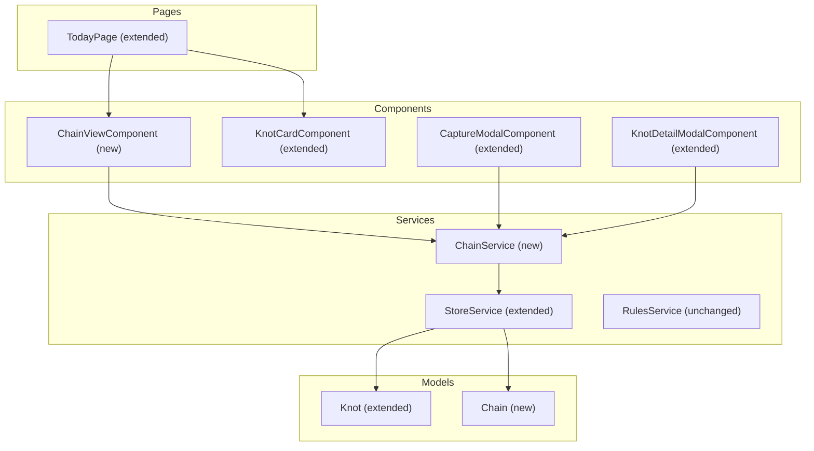

# Design Document: Knot Chains (Cadenas de Nudos)

## Overview

Knot Chains introduces the ability to group individual knots into ordered linear sequences (chains) and visualize them in a vertical stepper/timeline view. The feature is entirely additive — knots without a chain continue to work exactly as before.

Key design goals:
- **Optional association**: Chain membership is opt-in during capture or post-creation.
- **Linear ordering**: Within a chain, knots have a strict numeric order with no gaps.
- **Dual views**: A toggle switches between the existing list view and a new sequence (chain) view on the Today page.
- **Integrity**: Chain data is kept referentially consistent across all mutating operations (create, delete, archive, import).
- **Persistence**: Chains are stored in LocalStorage alongside knots and events, following the same patterns used by `StoreService`.

## Architecture

The feature integrates into the existing Angular standalone-component architecture with no new dependencies. All state remains in LocalStorage via `StoreService`.



### Decision Rationale

| Decision | Rationale |
|----------|-----------|
| Separate `ChainService` | Keeps chain-specific logic (reordering, integrity, capacity checks) isolated from the existing `StoreService` CRUD, reducing merge conflicts and cognitive load. |
| Chain stored in own LocalStorage key | Follows existing pattern (`nudos_v1_knots`, `nudos_v1_events`) and avoids inflating the knots array. |
| `chainOrder` 0-based internally, displayed 1-based | Simplifies array operations while showing human-friendly numbering in UI. |
| Max 50 knots per chain | Prevents performance degradation of drag-reorder and vertical timeline rendering on mobile. |
| CDK DragDrop for reordering | Angular CDK DragDrop is already compatible with Ionic standalone components and supports touch + mouse. |

## Components and Interfaces

### New: `Chain` Model

```typescript
// src/app/models/chain.model.ts
export interface Chain {
  id: string;          // UUID (same format as Knot.id)
  name: string;        // 1–100 chars
  createdAt: number;   // Unix timestamp ms
}
```

### Extended: `Knot` Model

```typescript
// Added optional fields to existing Knot interface
export interface Knot {
  // ... existing fields unchanged ...
  chainId?: string | null;       // references Chain.id
  chainOrder?: number | null;    // 0-based position within chain
}
```

Invariant: `chainId` and `chainOrder` are both null or both non-null.

### New: `ChainService`

```typescript
// src/app/services/chain.service.ts
@Injectable({ providedIn: 'root' })
export class ChainService {
  readonly chains$: Observable<Chain[]>;

  getChains(): Chain[];
  getChainById(id: string): Chain | undefined;
  getChainKnots(chainId: string): Knot[];  // sorted by chainOrder asc
  getChainSize(chainId: string): number;

  createChain(name: string): Chain;
  deleteChain(chainId: string): void;

  addKnotToChain(knotId: string, chainId: string): void;
  removeKnotFromChain(knotId: string): void;
  moveKnotToChain(knotId: string, newChainId: string): void;

  reorderKnot(chainId: string, fromIndex: number, toIndex: number): void;

  // Integrity
  validateIntegrity(): void;  // clears orphan chainIds, removes empty chains
}
```

### New: `ChainViewComponent`

```typescript
// src/app/components/chain-view/chain-view.component.ts
@Component({ selector: 'app-chain-view', standalone: true })
export class ChainViewComponent {
  @Input() chains: Chain[];
  @Output() knotTapped: EventEmitter<string>;  // emits knotId
  @Output() refresh: EventEmitter<void>;
}
```

Responsibilities:
- Render vertical timeline per chain (nodes + connecting lines)
- Highlight active node (first non-DONE by chainOrder)
- Show quick action buttons (start, done, timer) inline
- Support drag-and-drop reorder via Angular CDK

### Extended: `CaptureModalComponent`

New UI flow added after existing fields:
1. **Chain selection radio group**: "Sin cadena" (default) | "Crear nueva cadena" | "Agregar a cadena existente"
2. Conditional inputs based on selection (chain name input or chain picker list)

### Extended: `KnotCardComponent`

When the knot has a `chainId`:
- Display a `Chain_Indicator` badge in the top badge row: `N/T` format (1-based display)
- Display truncated chain name (max 20 chars with ellipsis)

### Extended: `KnotDetailModalComponent`

When the knot belongs to a chain:
- Show "Quitar de cadena" action button
- Show chain name and position info
- Allow adding to / moving between chains

### Extended: `TodayPage`

- Add view toggle in header: "Vista lista" | "Vista secuencia"
- Conditionally render either `KnotCardComponent` list or `ChainViewComponent`
- Persist preference in LocalStorage (`nudos_ui_view_mode`)

## Data Models

### Storage Keys

| Key | Contents |
|-----|----------|
| `nudos_v1_knots` | `Knot[]` (existing, extended with `chainId`/`chainOrder`) |
| `nudos_v1_events` | `AppEvent[]` (existing, unchanged) |
| `nudos_v1_chains` | `Chain[]` (new) |
| `nudos_ui_view_mode` | `'list' \| 'chain'` (new, UI preference) |

### Chain Order Invariants

1. For any chain, the `chainOrder` values of its member knots form a consecutive 0-based sequence: `0, 1, 2, ..., n-1`.
2. No two knots in the same chain share the same `chainOrder`.
3. If a chain has 0 members, the chain record is deleted.
4. `chainId` ≠ null ⟺ `chainOrder` ≠ null.

### Export/Import Schema Extension

```json
{
  "version": 1,
  "exportedAt": 1700000000000,
  "knots": [...],
  "events": [...],
  "chains": [...]   // NEW — array of Chain objects
}
```

Import validation:
- If `chains` array is absent → treat as empty, clear any `chainId` on knots.
- If a knot references a `chainId` not present in `chains` → set `chainId` and `chainOrder` to null.
- Recalculate consecutive `chainOrder` for each chain after cleanup.

### Event Types Extension

New event types to add to `EventType`:

```typescript
| 'CHAIN_CREATED'
| 'CHAIN_DELETED'
| 'KNOT_ADDED_TO_CHAIN'
| 'KNOT_REMOVED_FROM_CHAIN'
| 'CHAIN_REORDERED'
```


## Correctness Properties

*A property is a characteristic or behavior that should hold true across all valid executions of a system — essentially, a formal statement about what the system should do. Properties serve as the bridge between human-readable specifications and machine-verifiable correctness guarantees.*

### Property 1: chainId/chainOrder Co-Nullity Invariant

*For any* knot in the system, `chainId` is non-null if and only if `chainOrder` is non-null. After any mutating operation (create, update, delete, archive, import, reorder, move), this invariant holds for every knot.

**Validates: Requirements 1.4**

### Property 2: Consecutive chainOrder Within a Chain

*For any* chain with N member knots, the set of `chainOrder` values for those knots forms exactly the sequence `{0, 1, 2, ..., N-1}` with no gaps and no duplicates. This holds after any operation that modifies chain membership or ordering (add, remove, delete, archive, reorder, move).

**Validates: Requirements 1.7, 4.2, 4.4, 8.4, 9.4, 9.5**

### Property 3: Referential Integrity (No Orphan chainIds, No Empty Chains)

*For any* system state after a persist operation: (a) every knot with a non-null `chainId` references a chain that exists in the `nudos_v1_chains` collection, and (b) every chain in storage has at least one knot that references it.

**Validates: Requirements 8.5, 9.2, 9.4, 9.5, 9.6**

### Property 4: Append to End

*For any* chain of current size N (where N < 50), when a knot is added to that chain, the knot receives `chainOrder = N` (the next position), and all previously existing knots retain their original `chainOrder` values unchanged.

**Validates: Requirements 3.2, 3.4**

### Property 5: Chain Name Validation

*For any* string composed entirely of whitespace characters (including empty string), attempting to create a chain with that name is rejected. Conversely, *for any* string of length 1–50 that contains at least one non-whitespace character, chain creation succeeds.

**Validates: Requirements 2.4**

### Property 6: Chain Creation Assigns First Position

*For any* valid chain name and knot, creating a new chain with that knot results in a chain record with the provided name and the knot having `chainOrder = 0` and `chainId` equal to the new chain's `id`.

**Validates: Requirements 2.2**

### Property 7: View Mode Persistence Round-Trip

*For any* valid view mode value (`'list'` or `'chain'`), persisting the preference and reading it back yields the same value. If no preference is stored, the default is `'list'`.

**Validates: Requirements 5.4, 5.5**

### Property 8: Active Node Identification

*For any* chain containing at least one non-DONE knot, the active node is the knot with the lowest `chainOrder` among those with status ≠ DONE. *For any* chain where all knots are DONE, there is no active node.

**Validates: Requirements 6.2, 10.5, 10.6**

### Property 9: Chain Display Order

*For any* set of chains, the display order in both the Chain_View and the chain selection list is sorted by `createdAt` descending (newest first).

**Validates: Requirements 3.1, 6.8**

### Property 10: Chain Indicator Badge Format

*For any* knot at `chainOrder = P` in a chain of total size `T`, the Chain_Indicator badge displays the string `(P+1)/(T)` — a 1-based position over total count.

**Validates: Requirements 7.1**

### Property 11: Chain Name Truncation

*For any* chain name, when displayed in the knot card badge row: if the name length exceeds 20 characters, it is truncated to the first 20 characters followed by an ellipsis ("…"); otherwise the full name is displayed.

**Validates: Requirements 7.2**

### Property 12: Knot Removal Preserves Non-Chain Fields

*For any* knot removed from a chain, the knot's `id`, `title`, `status`, `weight`, `impact`, `blockReason`, `context`, `createdAt`, and all other non-chain fields remain unchanged. Only `chainId` and `chainOrder` are set to null.

**Validates: Requirements 8.6**

### Property 13: Export Completeness

*For any* collection of chains in storage, the exported JSON contains a `chains` array that includes every chain record with matching `id`, `name`, and `createdAt` values.

**Validates: Requirements 9.1**

### Property 14: Reorder Correctness

*For any* chain of size N and any valid move from index F to index T (where 0 ≤ F < N, 0 ≤ T < N, F ≠ T), after reorder: the knot that was at position F is now at position T, and the resulting chainOrder values are exactly `{0, 1, ..., N-1}`.

**Validates: Requirements 4.2**

### Property 15: Move Between Chains

*For any* knot in chain A moved to chain B: (a) chain A's remaining knots maintain consecutive chainOrder 0..N-2, (b) the moved knot is at the last position of chain B (old size of B), (c) if chain A becomes empty it is deleted.

**Validates: Requirements 3.6**

## Error Handling

| Scenario | Handler | User Feedback |
|----------|---------|---------------|
| Chain name empty/whitespace-only | `CaptureModal` validation | Inline error message, submit disabled |
| Chain at max capacity (50 knots) | `ChainService.addKnotToChain` | Alert: "Esta cadena alcanzó su capacidad máxima (50 nudos)" |
| Reorder persist failure | `ChainViewComponent` | Revert visual positions + toast error "No se pudo guardar el reorden" |
| `transitionToDoing` fails (another DOING exists) | `ChainViewComponent` quick action | Alert with error message from RulesService |
| Orphan chainId detected on persist | `ChainService.validateIntegrity` | Silent auto-cleanup (set chainId/chainOrder to null), log event |
| Import with missing chains array | `StoreService.importData` | Silent handling — treat as empty chains, no error |
| Import with orphan chainId references | `StoreService.importData` | Silent cleanup during validation pass |
| Chain record not found when rendering badge | `KnotCardComponent` | Hide chain indicator silently |

### Error Recovery Strategy

All chain operations follow a **validate-then-persist** pattern:
1. Validate preconditions (capacity, existence, etc.)
2. Perform in-memory mutation
3. Persist to LocalStorage
4. Emit new state via BehaviorSubject

If step 3 throws (e.g., storage quota exceeded), the in-memory state is not committed and the UI shows an error. The `validateIntegrity()` method runs on `init()` and after import to catch and repair any inconsistencies.

## Testing Strategy

### Unit Tests (Example-based)

Focus areas:
- `Chain` model creation with valid/invalid names
- `CaptureModal` UI state transitions (no chain → new chain → existing chain)
- `KnotDetailModal` remove-from-chain button visibility
- `ChainViewComponent` rendering: active/done/pending node styling
- View toggle default behavior and persistence
- Edge cases: single-knot chain rendering, empty chain list, max capacity reached
- Quick actions: start, done, timer from chain view
- Error scenarios: persist failure rollback, concurrent DOING prevention

### Property-Based Tests (via fast-check)

Library: [fast-check](https://github.com/dubzzz/fast-check) — mature TypeScript PBT library.

Configuration:
- Minimum **100 iterations** per property
- Each test tagged with: `// Feature: knot-chains, Property N: <title>`

Properties to implement:
1. Co-nullity invariant after random operations
2. Consecutive chainOrder after random add/remove/reorder/move sequences
3. Referential integrity after random operation sequences
4. Append-to-end position correctness
5. Chain name validation (whitespace rejection, valid acceptance)
6. Chain creation assigns position 0
7. View mode round-trip
8. Active node identification across random chain states
9. Chain display order (createdAt descending)
10. Badge format `(P+1)/T`
11. Name truncation at 20 chars
12. Non-chain fields preserved after removal
13. Export completeness
14. Reorder correctness (moved item lands at target index)
15. Move between chains maintains integrity of both

### Generators

Custom `fast-check` generators needed:
- `arbChainName()`: string 1–50 chars with at least one non-whitespace character
- `arbKnot()`: valid Knot with random fields
- `arbChain(minSize, maxSize)`: Chain with N random knots at consecutive chainOrder
- `arbOperation()`: random chain operation (add, remove, reorder, move, delete, archive)

### Integration Tests

- Full capture flow: create knot → assign to new chain → verify storage
- View toggle: switch views, verify correct component rendered
- Drag reorder: simulate CDK DragDrop events, verify persistence
- Export/import round-trip with chains
- Knot deletion cascading chain cleanup
- Archiving cascading chain cleanup
